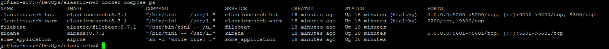
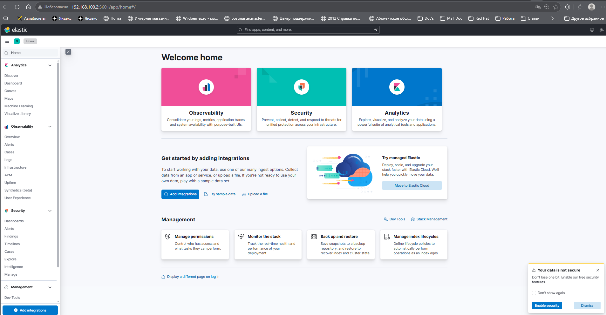
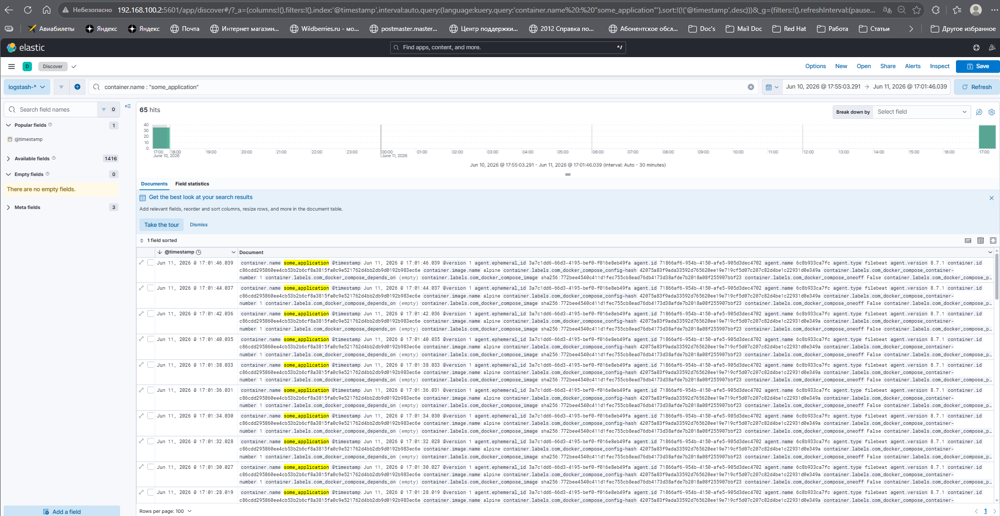

# Домашнее задание к занятию 15 «Система сбора логов Elastic Stack»

## Оглавление
- [Домашнее задание к занятию 15 «Система сбора логов Elastic Stack»](#домашнее-задание-к-занятию-15-система-сбора-логов-elastic-stack)
  - [Оглавление](#оглавление)
  - [Задание 1. ELK-стек в Docker](#задание-1-elk-стек-в-docker)
    - [Структура проекта](#структура-проекта)
    - [Запуск стека](#запуск-стека)
    - [Проверка работоспособности Elasticsearch](#проверка-работоспособности-elasticsearch)
    - [Результат выполнения задания:](#результат-выполнения-задания)
  - [Задание 2. Создание Index Patterns и работа с Kibana Discover](#задание-2-создание-index-patterns-и-работа-с-kibana-discover)

## Задание 1. ELK-стек в Docker

### Структура проекта

```
elastic-hw/
├── docker-compose.yml
├── logstash/
│   ├── config/
│   │   └── logstash.yml
│   └── pipeline/
│       └── logstash.conf
├── filebeat/
│   └── filebeat.yml
└── kibana/
    └── kibana.yml
```

---

### Запуск стека

**Шаг 1. Настройка `vm.max_map_count` (обязательно для Elasticsearch)**

```bash
# Временно (до перезагрузки)
sudo sysctl -w vm.max_map_count=262144

# Постоянно
echo "vm.max_map_count=262144" | sudo tee -a /etc/sysctl.conf
sudo sysctl -p
```

**Шаг 2. Запуск**

```bash
docker-compose up -d
```

**Шаг 3. Проверка статуса (через 5 минут)**

```bash
docker ps
```

---

### Проверка работоспособности Elasticsearch

```bash
# Статус кластера
curl -X GET "http://localhost:9200/_cluster/health?pretty"

# Список нод
curl -X GET "http://localhost:9200/_cat/nodes?v"

# Список индексов
curl -X GET "http://localhost:9200/_cat/indices?v"
```

---

### Результат выполнения задания:

- скриншот ```docker ps```

- скриншот интерфейса kibana

- [docker-compose манифест](docker-compose.yml)
- [filebeat.yml](filebeat/filebeat.yml)
- [kibana.yml](kibana/kibana.yml)
- [logstash.yml](logstash/config/logstash.yml)
- [logstash.conf](logstash/pipeline/logstash.conf)

## Задание 2. Создание Index Patterns и работа с Kibana Discover
